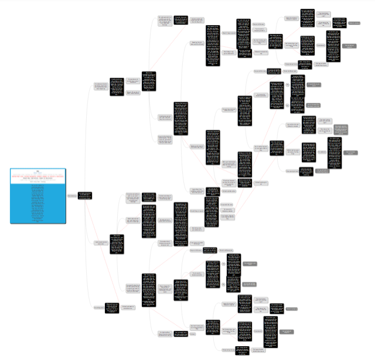
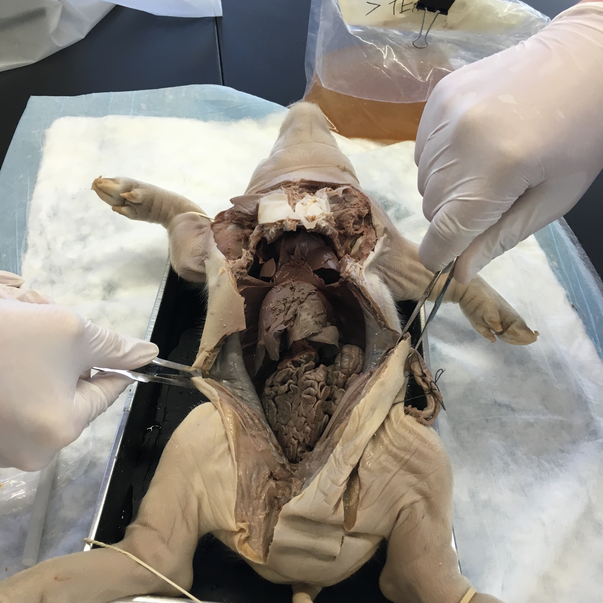

True Grit
=========

True Grit was the first project of sophomore year. In it, we had to create an interactive learning tool for students. The final product can be seen below.

Final Product
-------------
[interactive-here]

Design Process
--------------

We started out by creating a flowchart depicting all of the possible choices in the interactive. It grew quite extensive, but we still included every choice in the flowchart in the final interactive.

The desicions in this flowchart would have been implemented into whichever interactive we made, regardless.

Google Slides Decision Tree
---------------------------

This idea was just to make a slide for each fork on the flowchart, with hyperlinks to click on to choose which way to go. We ended up choosing this idea because it was simple, and doable by the deadline, as well as being friendlier to collaboration.

HTML5 Minigame
--------------

This idea was to write an HTML5 minigame using [Quintus.js](http://www.html5quintus.com) to write it and [github pages](https://pages.github.com) to host it.

I wrote a small demo of this before we decided on the Slides presentation, which you can play [here](true-grit-minigame/index.html).

Really Really Cold Case
=======================

In Really Really Cold Case, (RRCC) we designed a murder case involving a long dead victim and assailant. My group did the murder of Cleopatra by Iullus Antonius, her son in law.

Final Presentation
------------------
[presentation-here]

Evidence
--------
There were many different elements of the projects from each subject, all of which went into the final case file. The case file contained evidence, such as bloodstains (biology) or witness statements (english), a presentation of that evidence (technology), and our sentencing reccomendation, which we reccomended to the jury. At the end of the project, we presented our case to a jury of guests.

In biology, we did a weeklong fetal pig dissection lab, where we autopsied a fetal pig to learn about anatomy, and about how the police can gain evidence from the victim's body. In the lab, I was the lead 'pathologist' (not an actual pathologist), and I learned a lot about anatomy, and had much fun doing it.

Our case
--------
Our group chose Cleopatra as the victim, and Iullus Antonius as the assailant. His motivation for killing Cleopatra was that she had stolen his father from him, and disgraced his family name. Our main pieces of evidence were some fingerprints, a bloodstain, Cleopatra's stabbed heart (actually the pig heart), the suspect's knife, and witness statements.