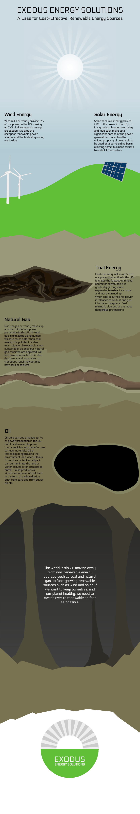

True Grit
=========

True Grit was the first project of sophomore year. In it, we had to create an interactive learning tool for students. The final product can be seen below.

Final Product
-------------
[interactive-here]

Design Process
--------------

We started out by creating a flowchart depicting all of the possible choices in the interactive. It grew quite extensive, but we still included every choice in the flowchart in the final interactive.

The desicions in this flowchart would have been implemented into whichever interactive we made, regardless.

Google Slides Decision Tree
---------------------------

This idea was just to make a slide for each fork on the flowchart, with hyperlinks to click on to choose which way to go. We ended up choosing this idea because it was simple, and doable by the deadline, as well as being friendlier to collaboration.

HTML5 Minigame
--------------

This idea was to write an HTML5 minigame using [Quintus.js](http://www.html5quintus.com) to write it and [github pages](https://pages.github.com) to host it.

I wrote a small demo of this before we decided on the Slides presentation, which you can play [here](true-grit-minigame/index.html).

Really Really Cold Case
=======================

In Really Really Cold Case, (RRCC) we designed a murder case involving a long dead victim and assailant. My group did the murder of Cleopatra by Iullus Antonius, her son in law.

Final Presentation
------------------
[presentation-here]

Evidence
--------
There were many different elements of the projects from each subject, all of which went into the final case file. The case file contained evidence, such as bloodstains (biology) or witness statements (english), a presentation of that evidence (technology), and our sentencing reccomendation, which we reccomended to the jury. At the end of the project, we presented our case to a jury of guests.

In biology, we did a weeklong fetal pig dissection lab, where we autopsied a fetal pig to learn about anatomy, and about how the police can gain evidence from the victim's body. In the lab, I was the lead 'pathologist' (not an actual pathologist), and I learned a lot about anatomy, and had much fun doing it.

Our case
--------
Our group chose Cleopatra as the victim, and Iullus Antonius as the assailant. His motivation for killing Cleopatra was that she had stolen his father from him, and disgraced his family name. Our main pieces of evidence were some fingerprints, a bloodstain, Cleopatra's stabbed heart (actually the pig heart), the suspect's knife, and witness statements.

Beneath The Surface
===================

In Beneath The Surface, (BTS) we were tasked with building a robotic submarine to compete in a submarine competition. We also had to do some secondary tasks such as a trailer for our spy firm.

Submarine
---------

Our submarine was designed to capture the lollipops from the shallow end of the pool. In order to achieve these goals, it had bilateral front facing motors for steering, and a hook at the bottom for grabbing the gamepiece.

This design failed miserably, because it flipped over in the water, and the motors produced less thrust while going forwards than backwards (because the motors were mounted backwards), so it failed to earn any points throughout the course of the game.

Quantum Leap
============

In Quantum Leap, (QL) we were tasked with creating a video game, to display at a con-like event at the end of the project.

Game Subject
------------

The game was required to relate to a few different time periods from human history, with the assumption that each of the time periods would be time traveled to. Instead of time travel though, we decided to stick all of the time periods together in an alien museum so we could avoid time travel altogether, but still have the different time periods.

We ended up going with 4 time periods, one for each group member:

 - The Viking Age (700s - 1000s) - Sophia
 - The Mongolian Empire (1206-1368) - Me
 - The Black Plague (1340s - 1350s) - Andrew
 - New Orleans Slave Trade (late 1700s) - Caden

The goal of the game was to rescue the people from each of these time periods, and lead them out of the museum, while fighting enemies including museum security, and innocent museum-goers. The game was co-op, with up to 4 people being able to play together using XBox controllers.

Charcters
---------

We chose to have 4 characters in our, one from each time period:

 - Viking Warrior
 - Mongol Cavalier
 - Plague Doctor
 - Voodoo Master

With Andrew, Caden, and Sophia drawing the characters, it took about 4 weeks to finish their animations and concepts.

You can see the characters in our digital art book:

[insert-digital-artbook-here]

Programming
-----------

Our game was written from scratch, and was compatible with Windows, MacOS, and Linux. Because of delays and problems encountered during programming, we didn't get everything we hoped for in the final demo showcased at Adacadon, but we were able to showcase the combat mechanics, which were the most important part of the demo.

Social Media
------------

We ran a twitter account here: [twitter.com/poisoneddrums](https://www.twitter.com/poisoneddrums)

Acadacon
--------

Once Acadacon came around, we had a booth with our digital artbook on display, and a Mac with our game running. Instead of relying on an extravagant booth, we used our actual game to showcase. Almost all the people who played had positive reactions, and one person even said it was the best game there.

Project Y
=========

Project Y was the last project of the year, so, to make it special, the facilitators decided that this project would be much more open-ended than other projects.

In this project, we were supposed to develop a concept for a product that helped solve a world problem. Everything else was left up to our group to decide.

Our Product
-----------

My group chose to develop a device that tracks your electricity usage, and tells you how much money you could save if you switched to a renewable energy source, such as rooftop solar panels.

It consists of a multimeter, a computer (raspberry pi), and a wireless router. The multimeter measures how much electricity is used by reading the main electricity inlet, and recording voltage and amperage. The data is transmitted using the router to a recipient computer that can store long-term data.

We were never able to construct the full prototype due to technical difficulties with the raspberry pi.

The Problems
------------

Our device was supposed to help solve the problem of the adoption of sustainable energy. The main reason fossil fuel based power generation is still dominant today is because renewable energy is not yet cheaper or more profitable than non-renewable energies.

